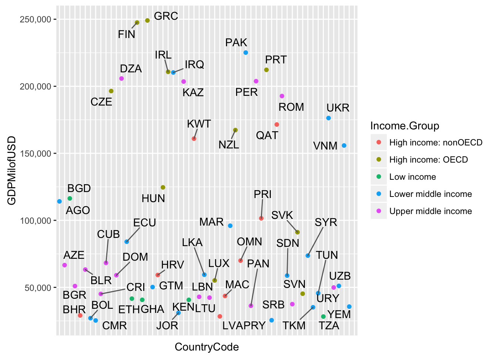

```r
  ##This project is to analyse the GDPs of all countries and look at all income groups and distribution of various countries compared to others


  ## Read csv files from https location

  X <- read.csv(url("https://d396qusza40orc.cloudfront.net/getdata%2Fdata%2FEDSTATS_Country.csv"))
  
  Y <- read.csv(url("https://d396qusza40orc.cloudfront.net/getdata%2Fdata%2FGDP.csv"),skip=4)
  
  colnames(Y)<- c('CountryCode','Ranking','Limiter','Economy','GDPMilofUSD')
  
  
  ##Merge by Country Code
  
  total <- merge(X,Y,by="CountryCode")

  ## convert x,00,000 USD to x00000 USD [Removes commas in numerics to add numeric sorting later]
  total$GDPMilofUSD<-as.numeric(gsub(",", "", as.character(total$GDPMilofUSD)))
```

```
## Warning: NAs introduced by coercion
```

```r
  ## Replaces spaces and '..' with NAs
  total[total==""]<-NA
  total[total==".."]<-NA
  
  
  
  #order by GDP
  totalArrange <- total[ order(as.numeric(as.character(total$GDPMilofUSD))), ] 
  
  #Print 13th country in the data frame
  #We observe here that the 13th country in the data frame is St. Kitts and Nevis
  
  print("13th country in the data frame is ")
```

```
## [1] "13th country in the data frame is "
```

```r
  print(totalArrange[13,]$Long.Name)
```

```
## [1] St. Kitts and Nevis
## 234 Levels: American Samoa Antigua and Barbuda ... World
```

```r
  #order by Income Group
  totalArrange <- total[ order(total$Income.Group), ] 
  
  
  
  
  ## Pattern to grep: High Income:OECD"
  ptn = 'High income: OECD' 
  ## Find all entries for High Income:OECD group
  HighIncomeOECD <- totalArrange[grep(ptn, totalArrange$Income.Group, perl=T),]
  print("average OECD mean is:")
```

```
## [1] "average OECD mean is:"
```

```r
  print(mean(as.numeric(as.character(HighIncomeOECD$Ranking))))
```

```
## [1] 32.96667
```

```r
  ##Pattern to grep:High income: nonOECD
  ptn = 'High income: nonOECD' 
  ## Find all entries for High Income:nonOECD group
  HighIncomenonOECD <- totalArrange[grep(ptn, totalArrange$Income.Group, perl=T),]
 
  ##High income: nonOECD, ignore NA -> Non assigned rankings
   print("average nonOECD mean is:")
```

```
## [1] "average nonOECD mean is:"
```

```r
   print(mean(as.numeric(as.character(HighIncomenonOECD$Ranking)), na.rm = TRUE))
```

```
## [1] 91.91304
```

```r
   ##Splitting total data set into smaller data sets for less crowded visualisations
 
  GDPlessthan20000 <- totalArrange[totalArrange$GDPMilofUSD < 25000,]
  GDPlessthan50000 <- totalArrange[totalArrange$GDPMilofUSD>=25000 & totalArrange$GDPMilofUSD<=250000, ]
  GDPlessthan500000 <- totalArrange[totalArrange$GDPMilofUSD>=250000 & totalArrange$GDPMilofUSD<=500000, ]
  GDPGreaterthan50000 <- totalArrange[totalArrange$GDPMilofUSD>=500000 & totalArrange$GDPMilofUSD<=1000000, ]
  GDPGreaterthan100000 <- totalArrange[totalArrange$GDPMilofUSD > 1000000,]
  
  ##plotting GDP vs Country code, highlighted by Income.group type, I am using 5 different plots here to cover all countries
  
  library(ggplot2)
  library(ggrepel)
  library(scales)
  
  ## plotting scatter plots for all countries using ggplot options, followed by single scatter plot for all countries in one plot
  
  ggplot(GDPlessthan20000, aes(CountryCode,GDPMilofUSD) )+ geom_point(data=GDPlessthan20000,aes(x=CountryCode, y=GDPMilofUSD,colour = Income.Group)) + scale_y_continuous(labels = comma)+ theme(axis.text.x=element_blank(),axis.ticks.x=element_blank())+geom_text_repel(aes(label = CountryCode),box.padding = unit(0.45, "lines"))
```

```
## Warning: Removed 21 rows containing missing values (geom_point).
```

```
## Warning: Removed 21 rows containing missing values (geom_text_repel).
```


```r
  ggplot(GDPlessthan50000, aes(CountryCode,GDPMilofUSD) )+ geom_point(data=GDPlessthan50000,aes(x=CountryCode, y=GDPMilofUSD,colour = Income.Group)) + scale_y_continuous(labels = comma)+ theme(axis.text.x=element_blank(),axis.ticks.x=element_blank())+geom_text_repel(aes(label = CountryCode),box.padding = unit(0.45, "lines"))
```

```
## Warning: Removed 21 rows containing missing values (geom_point).

## Warning: Removed 21 rows containing missing values (geom_text_repel).
```



```r
  ggplot(GDPlessthan500000, aes(CountryCode,GDPMilofUSD) )+ geom_point(data=GDPlessthan500000,aes(x=CountryCode, y=GDPMilofUSD,colour = Income.Group)) + scale_y_continuous(labels = comma)+ theme(axis.text.x=element_blank(),axis.ticks.x=element_blank())+geom_text_repel(aes(label = CountryCode),box.padding = unit(0.45, "lines"))
```

```
## Warning: Removed 21 rows containing missing values (geom_point).

## Warning: Removed 21 rows containing missing values (geom_text_repel).
```


```r
  ggplot(GDPGreaterthan50000, aes(CountryCode,GDPMilofUSD) )+ geom_point(data=GDPGreaterthan50000,aes(x=CountryCode, y=GDPMilofUSD,colour = Income.Group)) + scale_y_continuous(labels = comma)+ theme(axis.text.x=element_blank(),axis.ticks.x=element_blank())+geom_text_repel(aes(label = CountryCode),box.padding = unit(0.45, "lines"))
```

```
## Warning: Removed 21 rows containing missing values (geom_point).

## Warning: Removed 21 rows containing missing values (geom_text_repel).
```


```r
  ggplot(GDPGreaterthan100000, aes(CountryCode,GDPMilofUSD) )+ geom_point(data=GDPGreaterthan100000,aes(x=CountryCode, y=GDPMilofUSD,colour = Income.Group)) + scale_y_continuous(labels = comma)+ theme(axis.text.x=element_blank(),axis.ticks.x=element_blank())+geom_text_repel(aes(label = CountryCode),box.padding = unit(0.45, "lines"))
```

```
## Warning: Removed 21 rows containing missing values (geom_point).

## Warning: Removed 21 rows containing missing values (geom_text_repel).
```


```r
  ggplot(total, aes(CountryCode,GDPMilofUSD) )+ geom_point(data=total,aes(x=CountryCode, y=GDPMilofUSD,colour = Income.Group)) + scale_y_continuous(labels = comma)+ theme(axis.text.x=element_blank(),axis.ticks.x=element_blank())
```

```
## Warning: Removed 21 rows containing missing values (geom_point).
```


```r
  #From the scatter plots we observe that most countries have GDP (in Mil of USD is less ) than 1,000,000, the scatter plots have also been marked in different colors for different income groups 
  
  #order by Ranking
  totalArrange <- total[ order(as.numeric(as.character(total$Ranking))), ] 
  
  
  #Extract only GDP and Income group
  subsetGDP<-subset(totalArrange, select=c("GDPMilofUSD", "Income.Group"))
  
  
 
  # Split into 5 quantiles and print
  nr <- nrow(subsetGDP)
  print(split(subsetGDP, rep(1:5, each=nr/5, length.out=nr)))
```

```
## $`1`
##     GDPMilofUSD         Income.Group
## 210    16244600    High income: OECD
## 37      8227103  Lower middle income
## 100     5959718    High income: OECD
## 49      3428131    High income: OECD
## 66      2612878    High income: OECD
## 70      2471784    High income: OECD
## 27      2252664  Upper middle income
## 171     2014775  Upper middle income
## 97      2014670    High income: OECD
## 91      1841710  Lower middle income
## 33      1821424    High income: OECD
## 11      1532408    High income: OECD
## 61      1322965    High income: OECD
## 131     1178126  Upper middle income
## 107     1129598    High income: OECD
## 89       878043  Lower middle income
## 203      789257  Upper middle income
## 152      770555    High income: OECD
## 174      711050 High income: nonOECD
## 34       631173    High income: OECD
## 189      523806    High income: OECD
## 93       514060  Upper middle income
## 153      499667    High income: OECD
## 163      489795    High income: OECD
## 15       483262    High income: OECD
## 7        475502  Upper middle income
## 12       394708    High income: OECD
## 221      384313  Upper middle income
## 213      381286  Upper middle income
## 41       369606  Upper middle income
## 196      365966  Lower middle income
## 6        348595 High income: nonOECD
## 52       314887    High income: OECD
## 146      305033  Upper middle income
## 177      274701 High income: nonOECD
## 36       269869  Upper middle income
## 84       263259 High income: nonOECD
## 58       262832  Lower middle income
## 150      262597  Lower middle income
## 96       258217    High income: OECD
## 160      250182  Lower middle income
## 77       249099    High income: OECD
## 64       247546    High income: OECD
## 157      225143  Lower middle income
## 208    17426690                 <NA>
## 214          NA High income: nonOECD
## 217          NA  Lower middle income
## 218    72440449                 <NA>
## 
## $`2`
##     GDPMilofUSD         Income.Group
## 166      212274    High income: OECD
## 92       210771    High income: OECD
## 94       210280  Lower middle income
## 54       205789  Upper middle income
## 159      203790  Upper middle income
## 101      203521  Upper middle income
## 48       196446    High income: OECD
## 170      192711  Upper middle income
## 207      176309  Lower middle income
## 169      171476 High income: nonOECD
## 155      167347    High income: OECD
## 109      160913 High income: nonOECD
## 215      155820  Lower middle income
## 88       124600    High income: OECD
## 18       116355           Low income
## 4        114147  Lower middle income
## 164      101496 High income: nonOECD
## 126       95982  Lower middle income
## 187       91149    High income: OECD
## 57        84040  Lower middle income
## 192       73672  Lower middle income
## 156       69972 High income: nonOECD
## 45        68234  Upper middle income
## 13        66605  Upper middle income
## 23        63267  Upper middle income
## 118       59423  Lower middle income
## 86        59228 High income: nonOECD
## 53        59047  Upper middle income
## 175       58769  Lower middle income
## 123       55178    High income: OECD
## 211       51113  Lower middle income
## 19        50972  Upper middle income
## 80        50234  Lower middle income
## 209       49920  Upper middle income
## 202       45662  Lower middle income
## 188       45279    High income: OECD
## 44        45104  Upper middle income
## 125       43582 High income: nonOECD
## 112       42945  Upper middle income
## 122       42344  Upper middle income
## 63        41605           Low income
## 72        40711           Low income
## 102       40697           Low income
## 183       37489  Upper middle income
## 
## $`3`
##     GDPMilofUSD         Income.Group
## 158       36253  Upper middle income
## 220       35646  Lower middle income
## 198       35164  Lower middle income
## 99        31015  Lower middle income
## 20        29044 High income: nonOECD
## 124       28373 High income: nonOECD
## 205       28242           Low income
## 26        27035  Lower middle income
## 167       25502  Lower middle income
## 39        25322  Lower middle income
## 38        24680  Lower middle income
## 180       23864  Lower middle income
## 201       23320 High income: nonOECD
## 47        22767 High income: nonOECD
## 62        22390 High income: nonOECD
## 223       20678           Low income
## 3         20497           Low income
## 206       19881           Low income
## 154       18963           Low income
## 85        18434  Lower middle income
## 69        18377  Upper middle income
## 76        17697 High income: nonOECD
## 22        17466  Upper middle income
## 222       17204           Low income
## 29        16954 High income: nonOECD
## 71        15747  Lower middle income
## 162       15654  Lower middle income
## 98        14755  Upper middle income
## 31        14504  Upper middle income
## 142       14244           Low income
## 176       14046  Lower middle income
## 104       14038           Low income
## 40        13678  Lower middle income
## 95        13579    High income: OECD
## 147       13072  Upper middle income
## 194       12887           Low income
## 5         12648  Upper middle income
## 151       10507  Lower middle income
## 144       10486  Upper middle income
## 17        10441           Low income
## 135       10308           Low income
## 140       10271  Lower middle income
## 129        9975           Low income
## 8          9951  Lower middle income
## 
## $`4`
##     GDPMilofUSD         Income.Group
## 224        9802           Low income
## 134        9613  Upper middle income
## 111        9418           Low income
## 136        8722 High income: nonOECD
## 21         8149 High income: nonOECD
## 87         7843           Low income
## 16         7557           Low income
## 128        7253  Lower middle income
## 172        7103           Low income
## 197        6972           Low income
## 149        6773           Low income
## 103        6475           Low income
## 108        6445  Lower middle income
## 127        6075 High income: nonOECD
## 73         5632           Low income
## 25         5474 High income: nonOECD
## 186        5012  Upper middle income
## 139        4373  Upper middle income
## 145        4264           Low income
## 28         4225 High income: nonOECD
## 143        4199           Low income
## 65         3908  Upper middle income
## 195        3814           Low income
## 179        3796           Low income
## 190        3744  Lower middle income
## 60         3092           Low income
## 82         2851  Lower middle income
## 1          2584 High income: nonOECD
## 14         2472           Low income
## 121        2448  Lower middle income
## 130        2222  Lower middle income
## 32         2184           Low income
## 43         1827  Lower middle income
## 30         1780  Lower middle income
## 113        1734           Low income
## 24         1493  Lower middle income
## 199        1293  Lower middle income
## 115        1239  Upper middle income
## 10         1134  Upper middle income
## 191        1129  Upper middle income
## 178        1008           Low income
## 74          917           Low income
## 75          822           Low income
## 216         787  Lower middle income
## 
## $`5`
##     GDPMilofUSD         Income.Group
## 78          767  Upper middle income
## 106         767  Upper middle income
## 212         713  Upper middle income
## 219         684  Lower middle income
## 42          596           Low income
## 51          480  Upper middle income
## 200         472  Lower middle income
## 68          326  Lower middle income
## 185         263  Lower middle income
## 161         228  Upper middle income
## 132         182  Lower middle income
## 105         175  Lower middle income
## 204          40  Lower middle income
## 2            NA High income: nonOECD
## 9            NA  Upper middle income
## 35           NA High income: nonOECD
## 46           NA High income: nonOECD
## 50           NA  Lower middle income
## 55     10329684                 <NA>
## 56      1887950                 <NA>
## 59     12192344                 <NA>
## 67           NA High income: nonOECD
## 79           NA High income: nonOECD
## 81           NA High income: nonOECD
## 83     49717634                 <NA>
## 90           NA High income: nonOECD
## 110     5344028                 <NA>
## 114          NA  Upper middle income
## 116      504431                 <NA>
## 117          NA High income: nonOECD
## 119     4823811                 <NA>
## 120    22769282                 <NA>
## 133    22249909                 <NA>
## 137          NA           Low income
## 138     1540807                 <NA>
## 141          NA High income: nonOECD
## 148          NA High income: nonOECD
## 165          NA           Low income
## 168          NA High income: nonOECD
## 173     2286093                 <NA>
## 181          NA High income: nonOECD
## 182          NA           Low income
## 184     1289813                 <NA>
## 193          NA High income: nonOECD
```

```r
  Top38GDPCountries <- head(subsetGDP,38)
 
  
  
  ## Pattern to grep:  Lowermiddleincome
  ptn = 'Lower middle income' 
  
  ## Find all entries for  Lowermiddleincome
  Lowermiddleincome_InTop38GDP <- Top38GDPCountries[grep(ptn, Top38GDPCountries$Income.Group, perl=T),]
  
  print("Number of Countries which are Lower middle income but among the 38 nations with highest GDP")
```

```
## [1] "Number of Countries which are Lower middle income but among the 38 nations with highest GDP"
```

```r
  print(dim(Lowermiddleincome_InTop38GDP))
```

```
## [1] 5 2
```

```r
  ## We observe from above that 5 countries are of lower middle income among the 38 nations with the highest GDP
  ## Conclusion: GDP ranking does not necessarily reflect the Income group and living standards in countries as gross GDP could be high but the income group of the country and standard of living might still be in a lower bracket
  
  
  ##hmtl and .d file created using rmarkdown::render("Filename.R", "html_document",clean=FALSE)
```


---
title: "RcaseStudy1.R"
author: "Harsha"
date: "Wed Nov  2 17:03:07 2016"
---
